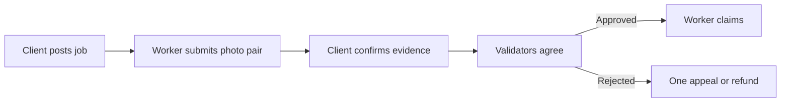

<div align="center">
  
  <h1>SiteVerdict</h1>
  <p><strong>Renovation work, settled by photo evidence.</strong></p>
  <p>
    
    
    
    
  </p>
  <p>
    <a href="#run-it">Run it</a> ·
    <a href="#the-loop">How it works</a> ·
    <a href="#contract-api">Contract API</a> ·
    <a href="#live-deployment">Live deployment</a>
  </p>
</div>

> Multi-modal contracting on GenLayer: verifying completion of physical
> renovation tasks with cryptographically signed photo proofs.

---

## The loop



1. The client posts a work order: description, acceptance criteria, site
   location, wage, and optionally a baseline photo hash plus a reference
   photo link.
2. A worker presses Join Job; the client approves the application.
   Self-joining is reverted on-chain.
2. The worker submits a **before and an after photo**. Both files are hashed
   (SHA-256, after a 1280px client-side downscale) and committed on-chain.
3. The client confirms the submission. Resolution stays locked before that,
   and the client can never take its own job.
4. Anyone triggers `resolve_task` with the photo bytes. The contract first
   re-hashes both photos against the committed hashes, then validators run
   the same vision inspection independently and must agree on approve/reject
   (confidence within 15 points). Reasoning text is display-only.
5. Approved: the worker claims (status PAID) and downloads a printable
   completion receipt. Rejected: one worker-only appeal, or the client
   refunds. Pre-confirm recovery: retract, reject, or cancel.

## Proof, not promises

| Before | After |
|---|---|
|  |  |

These are the actual sample photos from the contract test suite. Drag the
same pair in the app's comparison slider. Validators approved this pair at
confidence 98 and rejected an unrelated pair at 99.

## Why the verdict holds up

| Guarantee | Mechanism |
|---|---|
| Hash-bound evidence | `resolve_task` re-hashes judged bytes on-chain |
| Split parties | Creator self-submission reverted; baseline binds the before photo |
| Dual confirmation | `CONFIRMED` state gates every resolution |
| Real consensus | Leader proposes, validators re-run and compare decisions only |
| Appeal with memory | One worker-only appeal; every round preserved in history |
| No silent failure | App re-reads state after finality and reports disagreement honestly |
| Recovery without a clock | Retract, reject, or cancel pre-confirmation |

## Live deployment

- Contract (studionet, chain 61999):
  `0x5602646E58A4b34B328eA60B5d7b0bd975bd6c71`
- [Inspect the contract and its transactions](https://explorer-studio.genlayer.com/address/0x5602646E58A4b34B328eA60B5d7b0bd975bd6c71)
- Demo jobs on record: `demo-paint-03` (PAID, 1 round) and `demo-roof-03`
  (PAID after appeal, 2 rounds). Open them in `/console` or via
  `/console?job=demo-paint-03`.

## Run it

```bash
# Contract checks
genvm-lint check contracts/site_verdict.py
gltest tests/integration/ -v -s --network studionet
```

```bash
# App
cd frontend && npm install && npm run dev
```

### Deploy the app (Vercel)

1. Push this repo to GitHub.
2. Vercel: Add New, Project, import the repo.
3. **Root Directory:** `frontend`. Framework preset: Next.js (auto-detected).
   Build: `npm run build`. No environment variables needed.
4. Open `/console`, connect MetaMask or Rabby, switch to the GenLayer
   Studio network when asked.

## Contract API

| Method | Caller | Result |
|---|---|---|
| `create_task(id, description, requirements, reward_atto, baseline_hash, location, reference_url)` | client | OPEN |
| `join_job(id)` | a different wallet | APPLIED |
| `approve_worker(id)` / `reject_join(id)` | client | ASSIGNED / back to OPEN |
| `cancel_join(id)` | applicant | back to OPEN |
| `submit_proof(id, proof_hash, before_hash)` | a different wallet | SUBMITTED |
| `confirm_evidence(id)` | client | CONFIRMED |
| `reject_submission(id)` / `retract_proof(id)` | client / worker | back to OPEN |
| `cancel_task(id)` | client, pre-confirm | CANCELLED |
| `resolve_task(id, before_image, after_image)` | anyone, CONFIRMED only | APPROVED / REJECTED |
| `appeal(id, proof_hash, before_hash)` | worker, once | SUBMITTED |
| `claim_reward(id)` | worker, APPROVED only | PAID |
| `refund(id)` | client, REJECTED only | REFUNDED |
| `get_task(id)` / `list_tasks()` | anyone | read |

## Completion receipt

Every PAID job offers **Download Receipt**: company header, job details,
parties, the AI verdict with confidence and reasoning, per-round evidence
history, and a timeline where each step links to its explorer transaction.
Step times come from chain blocks (device time is only a labeled fallback).

## Test report

8 integration tests on studionet with real consensus, plus 2 live demo
lifecycles on the deployed contract. Wrong-state guards cover all 12
methods across three roles (creator, worker, stranger). See
`tests/integration/`.

## Honest limitations

- **Accounting only, not escrow.** Wages are recorded numbers; no GEN is
  locked or moved. `PAID` authorizes payment off-chain.
- **No on-chain clock** in this runner, so expiry is state-based.
- **Vision variance** on borderline photos; strict pairs decide consistently.
- **Studionet rate limits** (60 req/min shared); the app explains waits.
